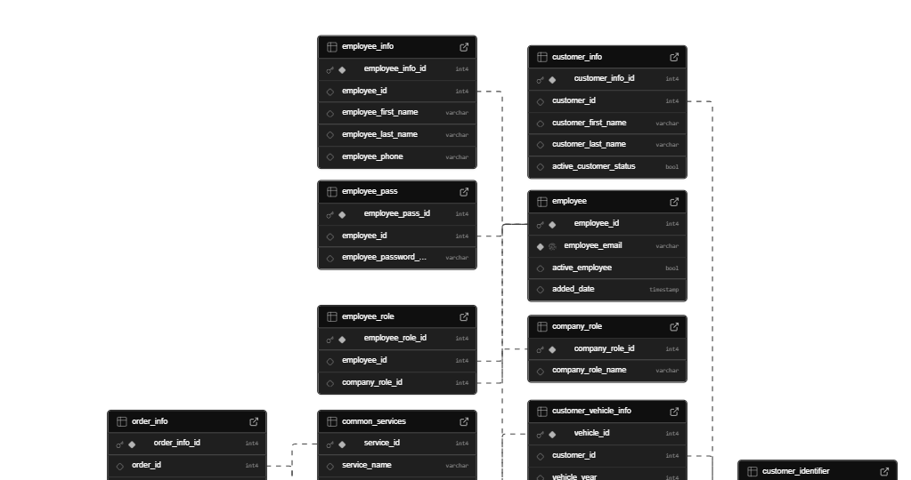

# 🚗 Abe's Garage Backend

> The robust and scalable backend for the Abe's Garage Management System. Built with Node.js, Express, and MySQL, it provides a secure and efficient API for the frontend application.

---

## 🚀 Overview

This backend provides a comprehensive API for managing all aspects of Abe's Garage operations, including employee management, customer records, vehicle servicing, and business analytics. It's designed to be secure, scalable, and easy to maintain.


## 🏛️ System Architecture

The backend is built following a standard Model-View-Controller (MVC) architectural pattern, adapted for a headless API:

- **Routes:** Define the API endpoints and their corresponding HTTP methods. They are responsible for receiving requests and forwarding them to the appropriate controllers.
- **Controllers:** Handle the incoming requests, validate the data, and call the appropriate services to perform the business logic. They are responsible for sending the response back to the client.
- **Services:** Contain the core business logic of the application. They interact with the database and perform all the necessary operations.
- **Middlewares:** Provide a way to run code before the request reaches the controller. In this application, middleware is used for authentication and authorization, ensuring that only authenticated and authorized users can access protected endpoints.

---

## 🗄️ Database Schema

The backend uses a MySQL database with the following schema:





The database schema is designed to maintain referential integrity through foreign key constraints and supports the core business operations of the garage management system.


## Endpoints

All endpoints are protected by a JWT-based authentication middleware, and most require admin privileges.

| Method | Endpoint              | Description                            |
| :----- | :-------------------- | :------------------------------------- |
| `POST` | `/api/employee/login` | Logs in an employee and returns a JWT. |
| `GET`  | `/install`            | Sets up the initial database schema.   |

### 📊 Dashboard

| Method | Endpoint                           | Description                                                    |
| :----- | :--------------------------------- | :------------------------------------------------------------- |
| `GET`  | `/api/dashboard/kpis`              | Retrieves key performance indicators (KPIs) for the dashboard. |
| `GET`  | `/api/dashboard/order-trends`      | Retrieves data for the order trends chart.                     |
| `GET`  | `/api/dashboard/revenue-breakdown` | Retrieves data for the revenue breakdown chart.                |

### 🧑‍💼 Employee Management

| Method   | Endpoint            | Description                                  |
| :------- | :------------------ | :------------------------------------------- |
| `POST`   | `/api/employee`     | Creates a new employee.                      |
| `GET`    | `/api/employees`    | Retrieves a paginated list of all employees. |
| `GET`    | `/api/employee/:id` | Retrieves a single employee by their ID.     |
| `PUT`    | `/api/employee`     | Updates an employee's information.           |
| `DELETE` | `/api/employee/:id` | Deletes an employee by their ID.             |

### 👤 Customer Management

| Method | Endpoint               | Description                                  |
| :----- | :--------------------- | :------------------------------------------- |
| `POST` | `/api/customer`        | Creates a new customer.                      |
| `GET`  | `/api/customer/search` | Searches for customers by keyword.           |
| `GET`  | `/api/customers`       | Retrieves a paginated list of all customers. |
| `GET`  | `/api/customer/:id`    | Retrieves a single customer by their ID.     |
| `PUT`  | `/api/customer`        | Updates a customer's information.            |

### 🚗 Vehicle Management

| Method | Endpoint                             | Description                                     |
| :----- | :----------------------------------- | :---------------------------------------------- |
| `POST` | `/api/vehicle`                       | Creates a new vehicle.                          |
| `GET`  | `/api/vehicle/:id`                   | Retrieves a single vehicle by its ID.           |
| `GET`  | `/api/vehicle/customer/:customer_id` | Retrieves all vehicles for a specific customer. |
| `PUT`  | `/api/vehicle`                       | Updates a vehicle's information.                |

### 🛠️ Service Management

| Method   | Endpoint           | Description                           |
| :------- | :----------------- | :------------------------------------ |
| `POST`   | `/api/service`     | Creates a new service.                |
| `GET`    | `/api/service`     | Retrieves a list of all services.     |
| `GET`    | `/api/service/:id` | Retrieves a single service by its ID. |
| `PUT`    | `/api/service`     | Updates a service's information.      |
| `DELETE` | `/api/service/:id` | Deletes a service by its ID.          |

### 📝 Order Management

| Method | Endpoint                   | Description                                   |
| :----- | :------------------------- | :-------------------------------------------- |
| `POST` | `/api/order`               | Creates a new order.                          |
| `GET`  | `/api/orders`              | Retrieves a paginated list of all orders.     |
| `GET`  | `/api/order/:hash`         | Retrieves a single order by its hash.         |
| `GET`  | `/api/orders/customer/:id` | Retrieves all orders for a specific customer. |
| `PUT`  | `/api/order/:id`           | Updates an order's status.                    |

---

## 🛠️ Local Development & Setup

1.  **Navigate to the backend directory:**
    ```bash
    cd backend
    ```
2.  **Install dependencies:**
    ```bash
    npm install
    ```
3.  **Create a `.env` file** and add your MySQL database credentials:
    ```
    DB_HOST=your_db_host
    DB_USER=your_db_user
    DB_PASSWORD=your_db_password
    DB_DATABASE=your_db_name
    JWT_SECRET=your_jwt_secret
    ```
4.  **Set up the database** by running the initial queries located in `backend/services/sql/initial-queries.sql`.
5.  **Start the backend server:**
    `bash
    npm start
    `
    The server will be running on `http://localhost:8000`.
